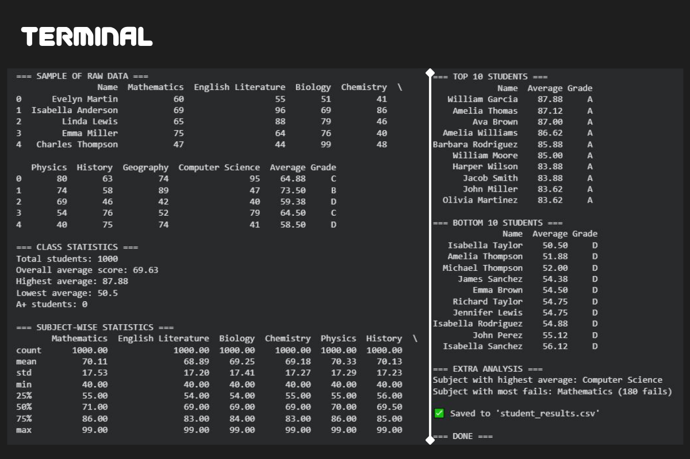

# 🎓 Grader

[](https://python.org)
[](https://pandas.pydata.org)
[](https://numpy.org)
[](LICENSE)
[](https://github.com/ellerbrock/open-source-badges/)

> **A lightweight, dependency-minimal tool to generate and analyze synthetic student performance data — perfect for demos, teaching, or prototyping academic dashboards.**

No databases. No web frameworks. Just clean Python, realistic names, and insightful stats — all in one file.

---

## 🌟 Features

| ✅ Realistic Data | 📊 Smart Analysis | 📤 Easy Export |
|------------------|------------------|----------------|
| Full names (e.g., `Emma Smith`) | Grade classification (A+, A, B...) | Saves to `sample_output.csv` |
| Real subjects (Math, Biology, etc.) | Top/Bottom 10 students | Human-readable console output |
| Configurable class size | Subject-wise stats & failure rates | Correlation matrix included |
| No duplicate names | Overall class performance metrics | — |

---

## 🚀 Quick Start

### 1. Clone & Run
```bash
git clone https://github.com/ramoware/grader.git
cd grader
python analyze_grades.py
```

### 2. View Output
- Console: Instant stats & rankings  
- File: `sample_output.csv` (open in Excel, Google Sheets, or pandas)

> ⚡ **Zero dependencies beyond pandas & numpy** — likely already installed!

---

## 📸 Sample Output

<p align="center">
  
</p>

---

## Console Report
```text
=== TOP 10 STUDENTS ===
        Name  Average Grade
 Olivia Lee     94.13    A+
Evelyn Clark     93.88    A+
...
```

---

## CSV Preview (`sample_output.csv`)
| Name            | Mathematics | English Literature | ... | Average | Grade |
|-----------------|-------------|--------------------|-----|---------|-------|
| Emma Smith      | 88          | 92                 | ... | 89.25   | A     |
| Liam Johnson    | 76          | 81                 | ... | 78.63   | B     |

> 🔍 **Tip**: The full CSV contains 1,000 students × 8 subjects + analytics columns.

---

## 🛠️ Customize It!

Edit the **top section** of [`analyze_grades.py`](analyze_grades.py) to:

- Add more student names
- Change subjects (e.g., add `"Economics"`)
- Adjust class size or grade ranges

```python
# ============================================================
# 🎯 CUSTOMIZABLE DATA SECTION — EDIT NAMES HERE!
# ============================================================
FIRST_NAMES = ["James", "Emma", "Liam", ...]
LAST_NAMES = ["Smith", "Johnson", ...]
SUBJECT_NAMES = ["Mathematics", "Biology", "Computer Science", ...]
NUM_STUDENTS = 1000
# ============================================================
```

---

## 📦 Dependencies

| Package   | Purpose                     | Install Command       |
|-----------|-----------------------------|------------------------|
| `pandas`  | Data manipulation & export  | `pip install pandas`   |
| `numpy`   | Random grade generation     | `pip install numpy`    |

👉 Or install via:
```bash
pip install -r requirements.txt
```

---

## 💡 Use Cases

- 🧑‍🏫 **Teaching**: Demonstrate data analysis concepts
- 🧪 **Prototyping**: Mock data for school dashboards
- 📈 **Portfolio**: Show clean, readable Python code
- 🤖 **Testing**: Generate test datasets for grading algorithms

---

## 📜 License

MIT License — feel free to use, modify, and share!  
See [LICENSE](LICENSE) for details.

---

## 🙌 Inspired By

- Real-world academic reporting needs  
- The beauty of minimal, self-contained scripts  
- Students who deserve better than `Student_123` 😅

---

> ✨ **Made with ❤️ and Python**  
> Star this repo if it helped you!
